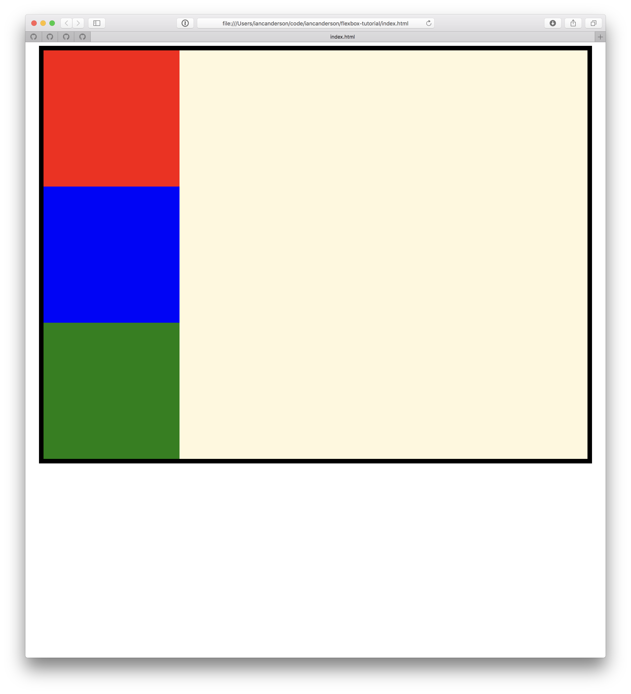
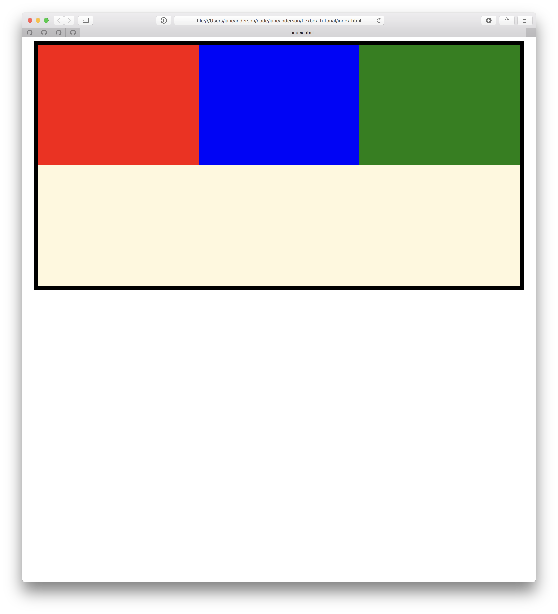
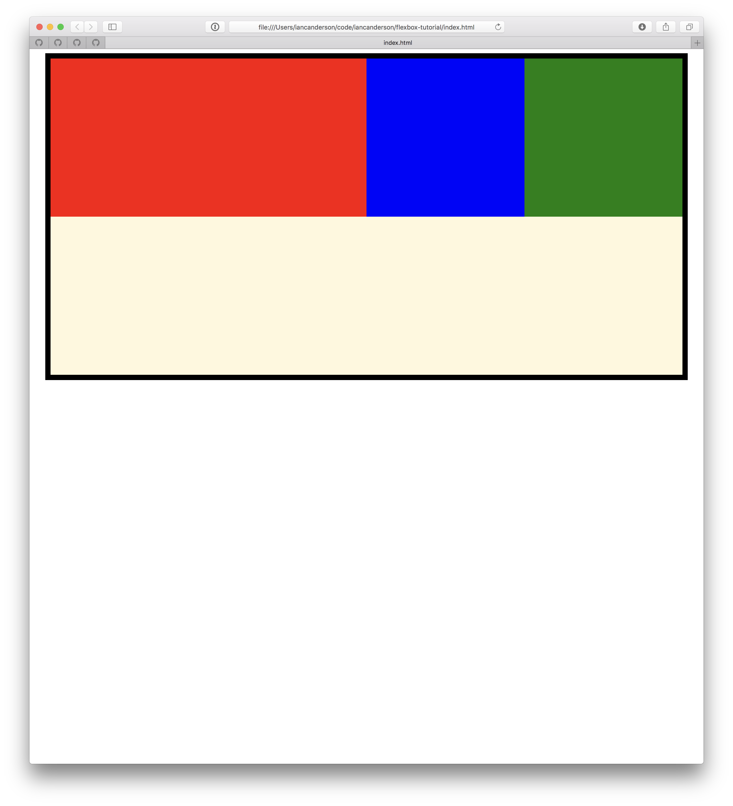
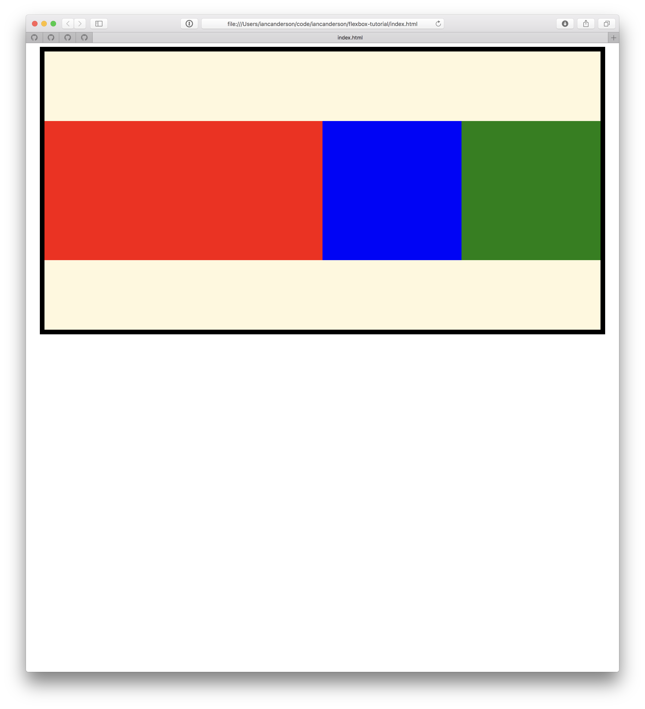

# Let's learn some flexbox!

This repo contains an index.html file that uses 4 different CSS files. The first
CSS file provides our starting point, and you'll need to fill in the rest of the
CSS files in order to match the corresponding screenshots. All of the necessary
selectors are provided in the css files - just add properties appropriately.

Go ahead and open index.html in your preferred browser, open 2.css in your
editor, and get coding!

Use this as a guide / refresher on flexbox:
https://developer.mozilla.org/en-US/docs/Web/CSS/CSS_Flexible_Box_Layout/Basic_Concepts_of_Flexbox

## 1.css

Here we have a container div with a black border and a beige background color.
It contains three divs, each with the same height and width and a different
background color so we can see how flexbox CSS properties affect the layout.

This file is all filled in for you, this is our starting place

## 2.css

Now we want to apply some flexbox properties to the container div and the inner
box divs so the boxes are all in the same row and fill the entire width of the
container.

Hints:
- Use the `display` and `flex` CSS properties.
- `flex-direction` defaults to `row`

## 3.css

Now we want the red box to take up half of the container's width, and the red
and green boxes to each take up a quarter of the container's width.

Hints:
- Use the `flex` or `flex-grow` property to make the red box grow twice as much
  as the other boxes

## 4.css

Now we want to vertically center all of the boxes within the container.

Hints:
- Use `align-items` to center the boxes vertically (the opposite axis of the flex
  direction)
